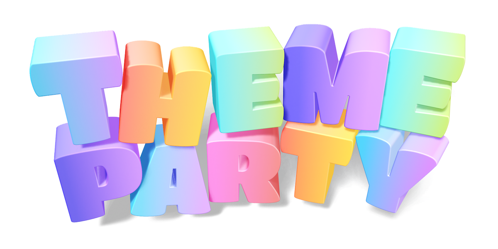

# Theme Party

Theme Party is an unstyled & unopinionated method of providing an interchangeable theme to React apps.
You can structure your theme objects however you like, and use any styling engine. Themes can override primitive values (such as colors & fonts)
as well as swap out entire components for more complex layout differences between themes.

## Quick Start

Theme Party has the following major exports:
- `ThemeParty`
- `ThemeProvider`
- `useTheme`
- `costumed`

### Install

```
yarn add theme-party
```

### Make your first theme party

Create your first `ThemeParty` instance. This is generally where you should define the shape of your theme
and the types & names of design tokens/primitives you will use. This an example, you can use any shape or token names.
If you're using TypeScript, the instance will infer the type of your theme object.

```ts
import { ThemeParty } from 'theme-party';

export const myThemeParty = new ThemeParty({
  color: {
    primary: '#85FFC7',
    secondary: '#297373',
    accent: '#FF8552',
    ghost: '#E6E6E6',
    text: '#39393A',
    link: theme => theme.color.primary,
  },
  spacing: {
    sm: '4px',
    md: '8px',
    lg: '16px',
  },
  typography: {
    sans: 'Arial',
    serif: 'Georgia',
  },
});
```

This instance can act as your default theme.

If you're using TypeScript, make your custom theme shape available to other `theme-party` utils by adding to the above:

```ts
declare module 'theme-party' {
  interface UserTheme {
    default: typeof myThemeParty;
  }
}
```

### Create an alternate theme

Create another theme by extending your first with overrides.

```ts
const myOtherTheme = myThemeParty.createTheme({
  color: {
    primary: '#CE2D4F', // this will update both the primary color and the link color (since link points to primary)
    secondary: theme => theme.color.accent,
  },
});
```

### Add a theme provider to your React app

```tsx
import { ThemeProvider } from 'theme-party';

export function App() {
  const [theme, setTheme] = useState(myThemeParty);

  return (
    <ThemeProvider theme={theme}>
      // ...
      <button onClick={() => setTheme(myOtherTheme)}>
        Change theme
      </button>
    </ThemeProvider>
  );
}
```

`ThemeProvider` takes a `ThemeParty` instance as its `theme` prop.
It can be nested further down in your component hierarchy to override the theme for its children.

### Use theme values in your components

Use the `useTheme` hook to retrieve your active theme's values.
This can be combined with any method of styling such as Emotion or Tailwind.

```tsx
import { useTheme } from 'theme-party';

export function Link({ children }) {
  const theme = useTheme();

  return (
    <a style={{ color: theme.color.link }}>
      {children}
    </a>
  );
}

```

### Override components

Create a "costumed" component containing your default markup.

```tsx
import { costumed } from 'theme-party';

interface Props {
  name: string;
}

export const MyComponent = costumed<Props>(function MyComponent({ name }) {
  return <h1>Hello, {name}</h1>;
});
```

In your theme, replace the component with another by calling `useComponent` with the original costumed component above and a replacement component that matches the same props;

```tsx
myOtherTheme.useComponent(MyComponent, ({ name }) => (
  <div>
    
  </div>
));
```

Then render the original component anywhere in your app. If the active theme has its own version of the component, it will be rendered in its place.

```tsx
function Page() {
  return (
    <MyComponent name="World" />
  );
}
```
